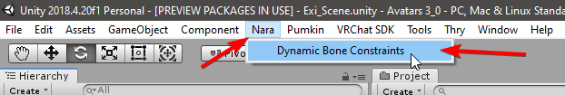
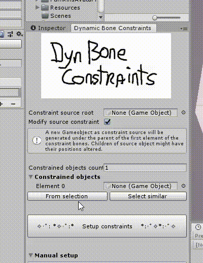

# Tutorial: PhysBone Rotation Constraints

## Step 0: Open the Chain Rotation Proxy window

Open the Chain Rotation Proxy tool under the `Window > Nara` (note: this screenshot below outdated) in the toolbar on the top.

## Step 1: Select bones

Select the bones you want to be affected.

Then in the Chain Rotation Proxy window click `From selection`.
If you want to waste time, you can drag them in one by one.

## Step 2: Setting up constraints

If `Constraint source root` is empty and `Modify source` is checked, clicking the `Setup constraints` button will generate a new chain of objects under the first element's parent.
It will also set up constraints on all the selected objects and their children.

## Step 3: Adding PhysBones

Now you can add PhysBones to the generated object and enjoy a better performing avatar!

## Extra: Using existing sources

Sometimes you want to reuse an existing chain of bones or game objects.
You can do this by dragging the root of that chain to the `Constraint source root`.
If you want to adapt the existing chain to the other game objects (generating new children and repositioning the y-position of the root), then leave `Modify source constraint` checked.
If it is unchecked, no new children will be generated and only the amount of objects in the length of the source chain will affect the constrained objects.
For example, you have a constrained object that goes 5 levels deep, but the source only goes 3 deep.
Only the first 3 levels in the constrained objects will get affected.
