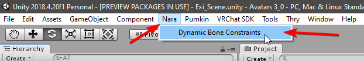
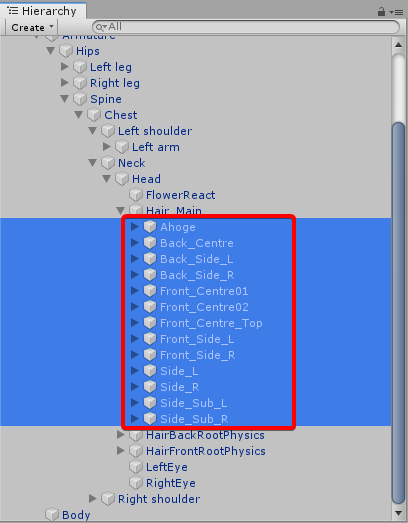
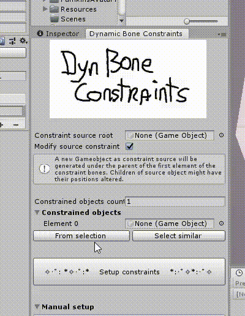
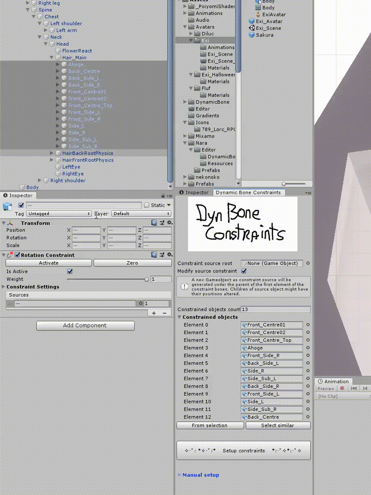
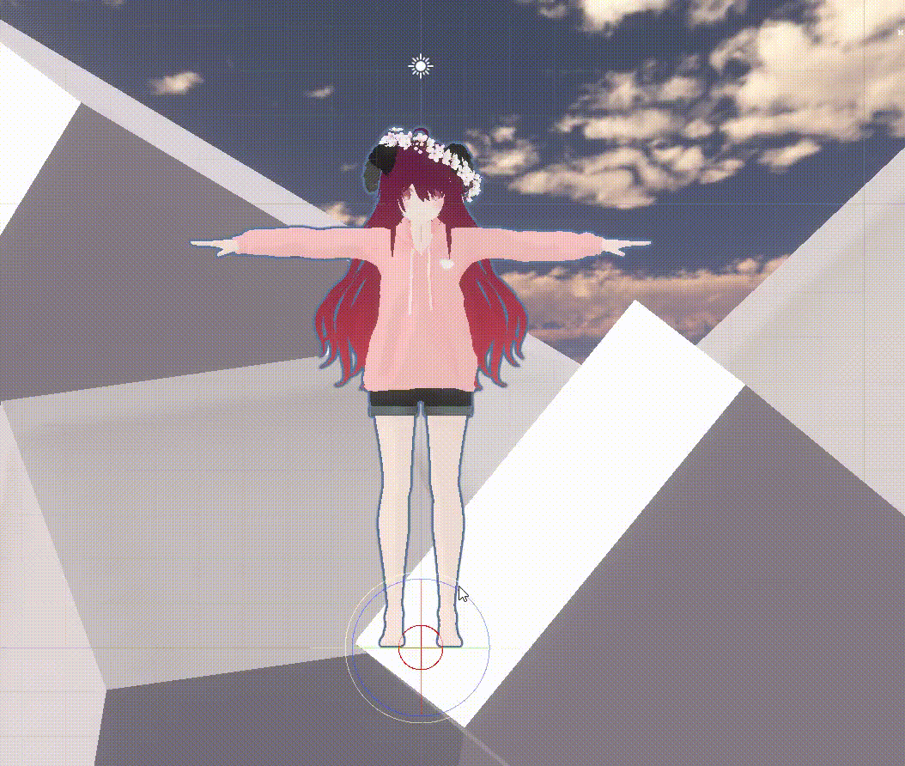
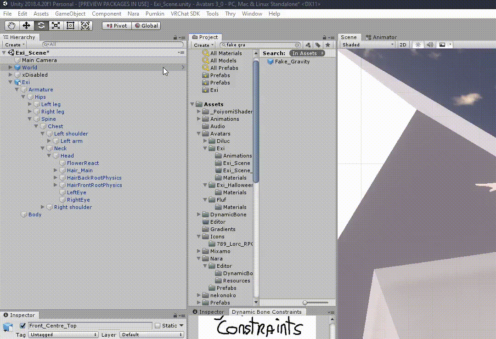
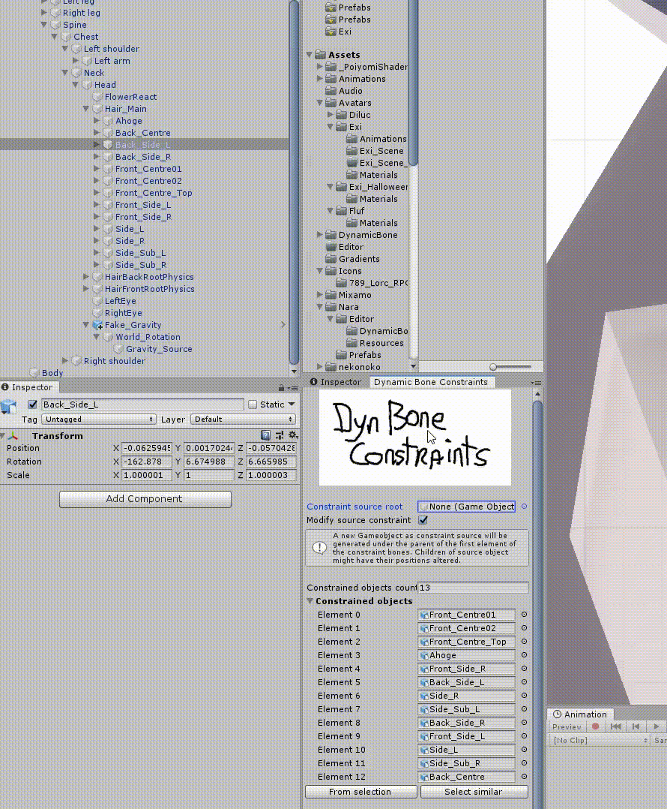

# Tutorial: (Dynamic) Bone Constraints

## Step 0: Open the DBC window

Open the Dynamic Bone Constraints tool under the `Window > Nara` (note: this screenshot below outdated) in the toolbar on the top.

## Step 1: Select bones

Select the bones you want to be affected.

Then in the DBC window click `From selection`.
If you want to waste time, you can drag them in one by one.

## Step 2: Setting up constraints

If `Constraint source root` is empty and `Modify source` is checked, clicking the `Setup constraints` button will generate a new chain of objects under the first element's parent.
It will also set up constraints on all the selected objects and their children.

## Step 3: Adding dynamic bones

Now you can add dynamic bones to the generated object and enjoy a better performing avatar!

## Extra: Using existing sources

Sometimes you want to reuse an existing chain of bones or GameObjects.
You can do this by dragging the root of that chain to the `Constraint source root`.
If you want to adapt the existing chain to the other gameobjects (generating new children and repositioning the y-position of the root), then leave `Modify source constraint` checked.
If it is unchecked, no new children will be generated and only the amount of objects in the length of the source chain will affect the constrained objects.
For example, you have a constrained object that goes 5 levels deep, but the source only goes 3 deep.
Only the first 3 levels in the constrained objects will get affected.

## Extra: Fake gravity

It is possible to fake gravity for long hair for avatar without any dynamic bones.
(Would be actually great if VRChat would actually allow constraints...)
It will not behave the same as Dynamic Bones, but it will let hair point downwards.
It works by cancelling out all rotations of the parent such that it will not rotate even if your avatar does, however it keeps the y rotation of the object so it will always look towards where you looking at.

First add the `Fake_Gravity` prefab from `Assets/Nara/Prefabs` to the object you want to bind it to.
For hair this should be the `Head`.

Next you want to expand the `Fake_Gravity` object and set the `Gravity_Source` as the `Constraint root source`.
We want to make sure that no additional children under `Gravity_Source` are generated, so uncheck `Modify source constraint`
If you want to add a swaying animation, you can leave the above checked and add animation to the generated objects.

Now your avatar doesn't even need dynamic bones!
