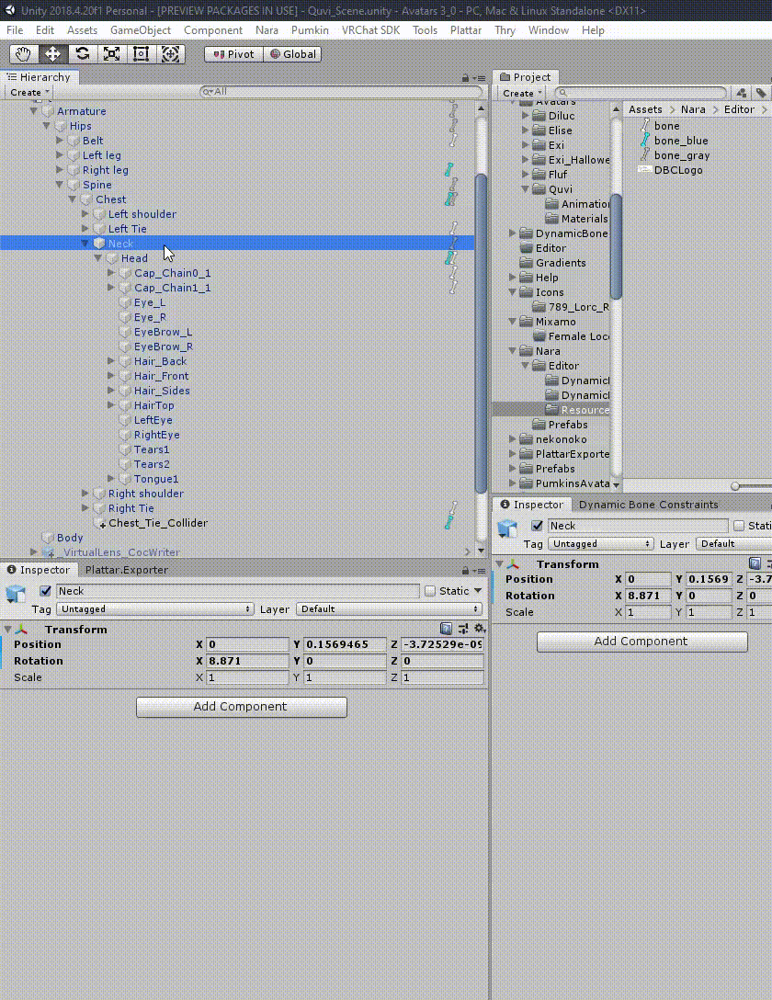

# Nara's Unity Tools (NUT)

Place for some of the tools I wrote for Unity.
Specifically for the creation of avatars for VRChat.

## Installation

Installation of Nara's Unity Tools is done via the Unity Package Manager.

### OpenUPM Method

_To do!_

### Git Method

Make sure [Git](https://git-scm.com/) is installed!

1. In Unity on the top toolbar, go to `Window > Package Manager`.
2. Click the `+` icon and select `Add package from Git URL`.
3. Enter the Git URL of this repository `https://github.com/Naraenda/NarasUnityTools.git`.

## Hierarchy improvements & context menus

Gives a small icon in the hierarchy on game objects that contain dynamic bones (white/gray) or dynamic bone colliders (blue).

Also adds a few other context menu items.
Mainly oriented around selecting and setting up dynamic bones.
You can right-click in the hierarchy to quickly select and filter down to dynamic bone components, so you can easily edit multiple items.
Right-clicking a dynamic bone component also allows you to quickly set its root transform to the component's game object.

## Animator Tools

Tool that allows the editing of multiple transitions.
This includes conditions and transition timings. Find the window in `Window > Nara > Animator Tools`.

## Dynamic Bone Constraints

[**>>> Tutorial <<<**](dbc_tutorial.md)

Instead of having 50 dynamic bone transformations hogging up the whole main thread it's better to have just a single chain of dynamic bones and have all other bones be move similarly to the single chain.
This can be done via rotation constraints which are significantly cheaper to compute, and they also can be computed on other threads!

The tool is pretty simple to use.
Open the window in `Window > Nara > Dynamic Bone Constraints`.
Select the objects you want to constrain and click the `From selection` button.
If you already have a chain of bones you want to bind these objects to, then use that as the `Constraint source root`.
`Modify source constraint` will modify (and if needed add) children of the root.
In most cases you can leave the `Constraint source root` empty and just click the magical `Setup constraints` button.
[You can have your dynamic bones on your avatar setup in 30 seconds!](https://youtu.be/byvG2FgJEhU)

## Help Me, I'm Stuck

For small questions you can tag me (Nara#0001) in the official VRChat Discord. Don't try to DM me, they are closed.
